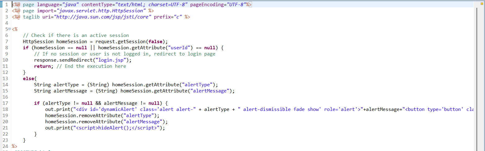

# Welcome to Train Reservation Project (RailEase)
## IMPORTANT NOTE: Always create your seperate branch and push changes there dont push in main branch, and before pushing take a git pull first and then only push(notify others after pushing changes in your branch).

## Getting Started
1) Clone the project to your local system
2) Create a **NEW** branch and then only make changes and push them to your own branch
3) Follow the below steps before creating your standalone frontend jsp page.

## Creating your own page
### Note: This step is to be followed only if your page is going to be set on a seperate URL, if the page is part of another page then it is a component and does not require this step to be used.

1) Create your JSP page
    
2) Copy the following contents of Home.jsp in your page
   

   1) page opens only if there is an active session
   2) sends alerts based on the alerts sent in session(look in registrationController to check sending alerts in sessions).
   
3) Copy the all the content of Home.css in your page.css
   (from start till line 220 or till the dynamicAlert style)

4) Copy the hideAlert() from Home.js in your page.js file
   

#### Note: Even if you don't require css or js file for your page it is mandatory to make this js and css file and copy the above mentioned content in them

# Login Session Data
After login based upon whether logged in as admin or user following data is stored in session of user.
1) User
   1) userId
   2) isAdmin
   3) userName
   
2) Admin
   1) userId
   2) isAdmin
   3) userName